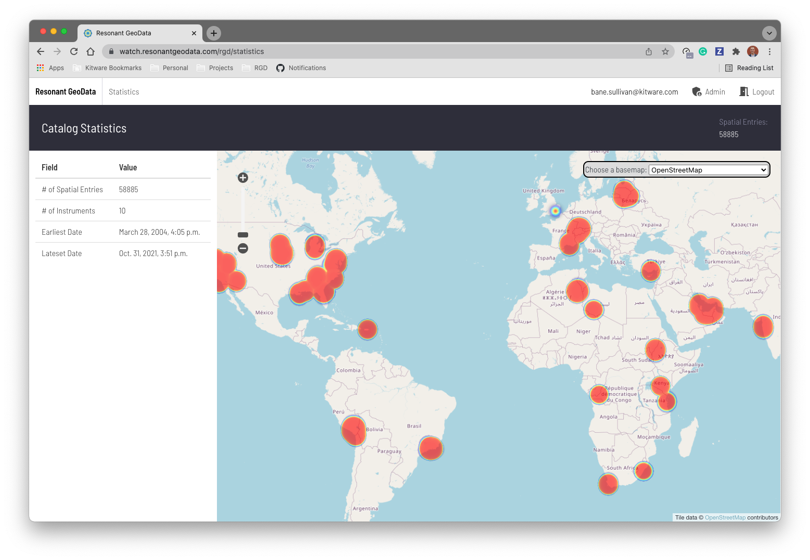

# ResonantGeoData WATCH Deployment

[](https://github.com/ResonantGeoData/RD-WATCH/actions/workflows/ci.yml)
[](https://codecov.io/gh/ResonantGeoData/RD-WATCH)

*Porject-specific deployment of ResonantGeoData for WATCH*




## 🌟 Highlights

- Ingest remotely hosted satellite imagery from STAC catalogs
- Search across imagery collections
- Visualize and download imagery
- Utilize Python client to upload processed imagery
- Extract Regions of Interest, subsample, and convert source imagery


### ✍️ Authors

This project is maintained by Kitware, Inc. for the WATCH project


## ⬇️ Install Python Client

The Python client can be installed from this repositories package index:

```bash
pip install --find-links https://resonantgeodata.github.io/RD-WATCH/ rgd-watch-client
```


## 💭 Feedback

For help with this deployment, please open a [Discussion](https://github.com/ResonantGeoData/RD-WATCH/discussions)


## 💻 Development

Please see [DEVELOPMENT.md](./DEVELOPMENT.md)
